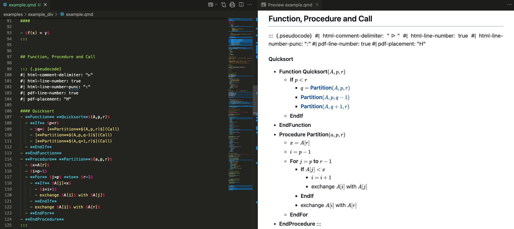
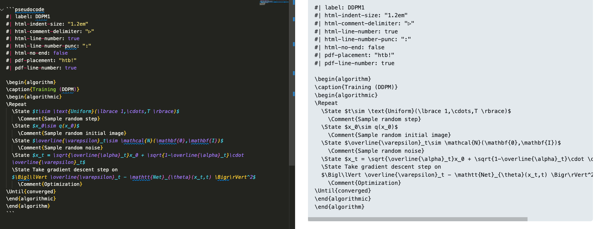
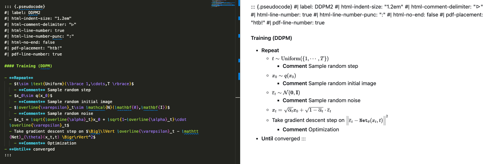
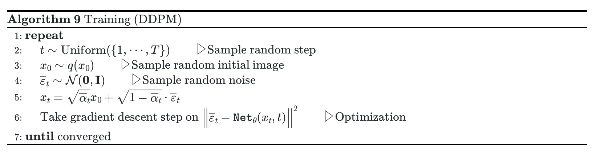
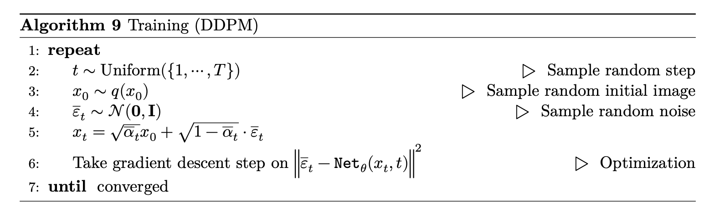

# Quarto Pseudocode Extension

- **新增档案**：`pseudocode_div.lua` 以及放例子的资料夹 `example_div`。

- **新增功能**：可以使用 `pseudocode` 的 `div`，以便我们在 markdown 编辑时可以预览 pseudocode。

  

- 作法是将 `div` 里的元素逐个变成原本要的格式。
见 `pseudocode_div.lua` 里的 `function stringify_el_pseudocode_plain(el)`。

- 由於新增的 lua filter 是修改 div，並不會影響原本的寫法。

## 使用方式

- 原本的
  ````markdown
  ```pseudocode
  ```
  ````
  变成使用
  ````markdown
  ::: {.pseudocode}
  :::
  ````

- 不需再使用 `\begin{algorithm}`, `\begin{algorithmic}`，并且将 `\caption{bla bla}` 改成 `#### bla bla`。

- 内容都要弄成 unordered list.

- 不需使用 `\State`。

- `\For`, `\If`, `\EndIf`, `\Procedure` 改成`**For**`, `**If**`, `**Procedure**` 且后面内容不需要括号起来。
  - 这里的 `\For`, `\If` 开头都要大写，`\EndIf` 的 `If` 要大写。

- `\Call{Partition}{$A,p,r$}` 改成 `[**Partition**$(A,p,r)$](Call)`。

## 一些限制

- 如果 caption 要空白，则得需要 `#### `。
- `#### caption` 跟 `#| html-line-number: true` 这些得留一个空行。
- 这里的 unordered list 不能有跨行，且每句不能换行。
  例如
  ````markdown
  ::: {.pseudocode}

  #### 
  - bla bla.
  - bla bla.
  :::
  ````
  **不能**是下面这两种
  ````markdown
  ::: {.pseudocode}

  #### 
  - bla bla.

  - bla bla.
  :::
  ````
  ````markdown
  ::: {.pseudocode}

  #### 
  - bla 
    bla.
  - bla bla.
  :::
  ````


## Example

新增资料夹 `example_div` 里头有一些例子(包含原本的 `simple.qmd` 的例子)。
以下是另一个例子

### 原本的写法
````markdown
```pseudocode
#| label: DDPM1
#| html-indent-size: "1.2em"
#| html-comment-delimiter: "▷"
#| html-line-number: true
#| html-line-number-punc: ":"
#| html-no-end: false
#| pdf-placement: "htb!"
#| pdf-line-number: true

\begin{algorithm}
\caption{Training (DDPM)}
\begin{algorithmic}
\Repeat
  \State $t\sim \text{Uniform}(\lbrace 1,\cdots,T \rbrace)$
    \Comment{Sample random step}
  \State $x_0\sim q(x_0)$
    \Comment{Sample random initial image}
  \State $\overline{\varepsilon}_t\sim \mathcal{N}(\mathbf{0},\mathbf{I})$
    \Comment{Sample random noise}
  \State $x_t = \sqrt{\overline{\alpha}_t}x_0 + \sqrt{1-\overline{\alpha}_t}\cdot \overline{\varepsilon}_t$ 
  \State Take gradient descent step on
  $\Bigl\lVert \overline{\varepsilon}_t - \mathtt{Net}_{\theta}(x_t,t) \Bigr\rVert^2$
    \Comment{Optimization}
\Until{converged}
\end{algorithmic}
\end{algorithm}
```
````

在 vscode 的 markdown preview 里预览效果如下：



### 使用 div-pseudocode 的写法
````markdown
::: {.pseudocode}
#| label: DDPM2
#| html-indent-size: "1.2em"
#| html-comment-delimiter: "▷"
#| html-line-number: true
#| html-line-number-punc: ":"
#| html-no-end: false
#| pdf-placement: "htb!"
#| pdf-line-number: true

#### Training (DDPM)

- **Repeat**
  - $t\sim \text{Uniform}(\lbrace 1,\cdots,T \rbrace)$
    - **Comment** Sample random step
  - $x_0\sim q(x_0)$
    - **Comment** Sample random initial image
  - $\overline{\varepsilon}_t\sim \mathcal{N}(\mathbf{0},\mathbf{I})$
    - **Comment** Sample random noise
  - $x_t = \sqrt{\overline{\alpha}_t}x_0 + \sqrt{1-\overline{\alpha}_t}\cdot \overline{\varepsilon}_t$ 
  - Take gradient descent step on $\Bigl\lVert \overline{\varepsilon}_t - \mathtt{Net}_{\theta}(x_t,t) \Bigr\rVert^2$
    - **Comment** Optimization
- **Until** converged
:::
````

在 vscode 的 markdown preview 里预览效果如下：



而生成的 html, pdf 如下：

html | pdf
------- | -------
 | 