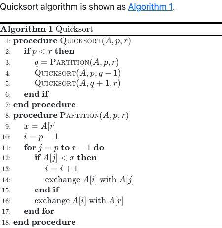

# Quarto 伪代码扩展


---

🇺🇸 [README](README.md) | 🇨🇳 [中文说明](README.zh.md)

一个用于在 `html` 和 `pdf` 格式输出中渲染伪代码的 Quarto 扩展。`html` 格式基于 [pseudocode.js](https://github.com/SaswatPadhi/pseudocode.js) 实现，`pdf` 格式基于 `algorithm` 和 `algpseudocode` 包实现。

> **Warning**  
> `html` 格式使用 Mathjax 3，可能与使用 Mathjax 2 的文档存在冲突。

## 安装

```bash
quarto add leovan/quarto-pseudocode
```

这将在 `_extensions` 子目录中安装本插件。如果使用版本控制，请检入到此目录。

## 使用

将如下内容添加到文档的头部或 `_quarto.yml` 文件中：

```
filters:
  - pseudocode
```

之后将伪代码添加到标记为 `pseudocode` 的代码块中。

````
```pseudocode
#| label: alg-quicksort
#| html-indent-size: "1.2em"
#| html-comment-delimiter: "//"
#| html-line-number: true
#| html-line-number-punc: ":"
#| html-no-end: false

\begin{algorithm}
\caption{Quicksort}
\begin{algorithmic}
\Procedure{Quicksort}{$A, p, r$}
  \If{$p < r$}
    \State $q = $ \Call{Partition}{$A, p, r$}
    \State \Call{Quicksort}{$A, p, q - 1$}
    \State \Call{Quicksort}{$A, q + 1, r$}
  \EndIf
\EndProcedure
\Procedure{Partition}{$A, p, r$}
  \State $x = A[r]$
  \State $i = p - 1$
  \For{$j = p$ \To $r - 1$}
    \If{$A[j] < x$}
      \State $i = i + 1$
      \State exchange
      $A[i]$ with     $A[j]$
    \EndIf
    \State exchange $A[i]$ with $A[r]$
  \EndFor
\EndProcedure
\end{algorithmic}
\end{algorithm}
```
````

> **Note**  
> 使用大驼峰式关键词，而非全大写关键词。

使用 `@<alg-label>` 进行引用。

```
Quicksort algorithm is shown as @alg-quicksort.
```

> **Note**  
> 对于 `book` 类型项目，跨文件引用仅在 `pdf` 格式中可用。

伪代码和应用以 `html` 和 `pdf` 格式的渲染结果如下所示。

| `html` 格式                      | `pdf` 格式                      |
| :------------------------------: | :-----------------------------: |
|  |  |

伪代码使用的参数格式类似 R 和 Python 代码。

| 参数                     | 默认值   | 格式   | 注释                                     |
| :----------------------- | :------- | :----- | :--------------------------------------- |
| `label`                  |          | all    | 用于引用的标签，如果有必须以 `alg-` 开头 |
| `html-indent-size`       | "1.2 em" | `html` | pseudocode.js 中的 `indentSize`          |
| `html-comment-delimiter` | "//"     | `html` | pseudocode.js 中的 `commentDelimiter`    |
| `html-line-number`       | true     | `html` | pseudocode.js 中的 `lineNumber`          |
| `html-line-number-punc`  | ":"      | `html` | pseudocode.js 中的 `lineNumberPunc`      |
| `html-no-end`            | false    | `html` | pseudocode.js 中的 `noEnd`               |

将如下内容添加到文档的头部或 `_metadata.yml` 文件中，可以将 `Algorithm` 转换为本地语言，例如中文的 `算法`。

```
pseudocode:
  alg-title: "算法"
  alg-prefix: "算法"
```

`alg-title` 用于伪代码的标题，`alg-prefix` 用于引用。

对于 `book` 类型项目，将如下内容添加到文档的头部或 `_quarto.yml` 文件中，在第 `x` 章中伪代码标题序号将变为 `x.n`。

```
format:
  pdf:
    include-before-body:
      text: |
        \numberwithin{algorithm}{chapter}
```

## 示例

1. 一个单文档的最小示例：[example.qmd](example.qmd)。
2. 一个 `book` 类型工程的最小示例：[_quarto.yml](_quarto.yml)。

## 版权

The MIT License (MIT)

Copyright (c) 2023 [范叶亮 | Leo Van](https://leovan.me)
